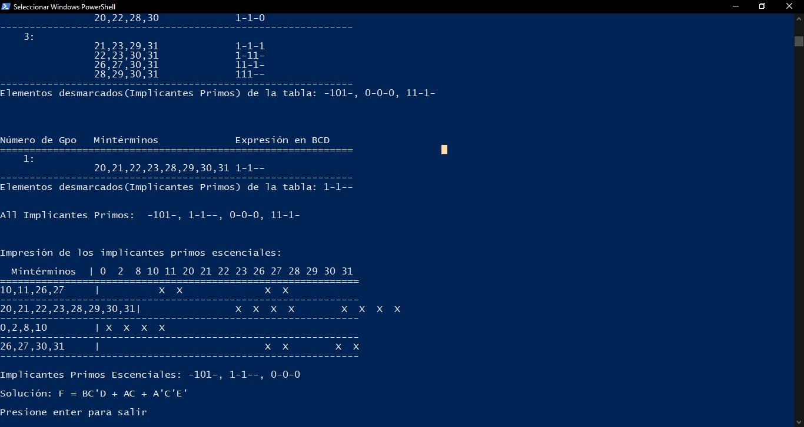

Esta es la implementación en Python 3 del algoritmo Quine McCluskey para minimizar las expresiones lógicas.

Este script de Python toma los mintérminos y los términos don't care (si los hay) como entrada y luego produce la expresión reducida como salida.

Muestra todo el proceso de cálculo del resultado.

Muestra los grupos de mintérminos, el gráfico de Implicantes Primos y los Implicantes Primos Esenciales, mientras calcula la salida.

Utiliza el Método de Petrick para calcular la expresión minimizada del gráfico de implicantes primos.

Método Quine McCluskey: https://en.wikipedia.org/wiki/Quine%E2%80%93McCluskey_algorithm

Método de Petrick: https://en.wikipedia.org/wiki/Petrick%27s_method

Demostración en vivo del script de Quine McCluskey Python: https://repl.it/@SumanAdhikari/Quine-McCluskey-Algorithm

Creé este script solo por diversión. Entonces, puede haber algunos errores. Siéntase libre de informarme.

Aquí está la captura de pantalla de un ejemplo:
